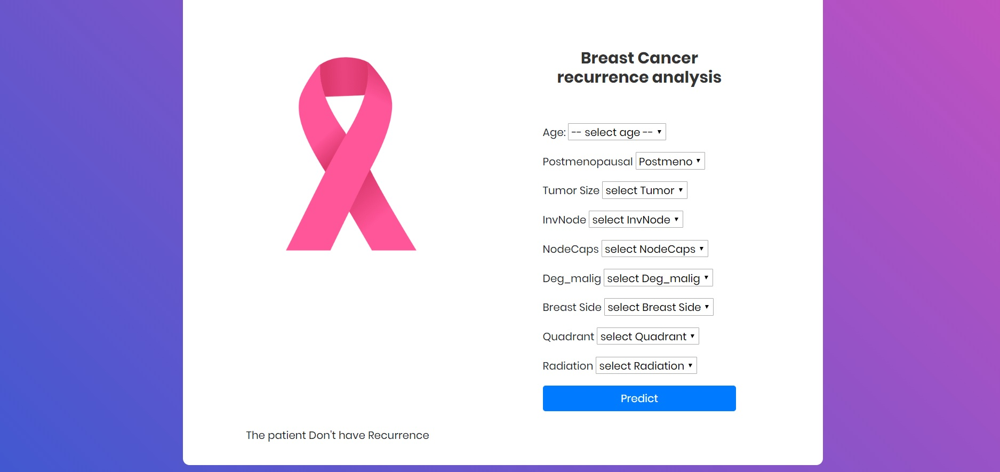

# Breast Cancer Recurrence Prediction 

## Business understating:

Based on the given dataset, we have to build a model to classify the patient’s data into two classes:
1.	Recurrence 
2.	Non-Recurrence 

#### Use-case: 

Early detection of cancer recurrence is more likely to be curable rather than when a women seeks treatments after the cancer symptoms are seen again. Thus, this classification task has high clinical significance and can be used to complement the traditional model of care.

A recurrence event is characterised by the cancer **“tumor appear again”** after at least a year of remission (Surgery).

_Local reappearance = again tumor developed in same organ_

_Regional = close to the treated organ (place)_
_Distant = another part of the body_
 

## Data Acquisition & Understanding: 

#### Data Source:

The data set is collected from publicly available UCI Machine Learning repository [(Breast Cancer Recurrence - Dataset)](https://archive.ics.uci.edu/ml/datasets/breast+cancer).

Variables:

~~~
Age: age of the patient at the time of diagnosis;

Menopause: whether the patient is pre- or postmenopausal at time of diagnosis;

Tumor size: the greatest diameter (in mm) of the excised tumor;

Inv-nodes: the number (range 0 - 39) of axillary lymph nodes that contain metastatic breast cancer visible on histological examination;  

Node caps: if the cancer does metastasise to a lymph node, although outside the original site of the tumor it may remain “contained” by the capsule of the lymph node. However, over time, and with more aggressive disease, the tumor may replace the lymph node and then penetrate the capsule, allowing it to invade the surrounding tissues;

Degree of malignancy: the histological grade (range 1-3) of the tumor. Tumors that are grade 1 predominantly consist of cells that, while neoplastic, retain many of their usual characteristics. Grade 3 tumors predominately consist of cells that are highly abnormal;

Breast: breast cancer may obviously occur in either breast;

Breast quadrant: the breast may be divided into four quadrants, using the nipple as a central point;

Irradiation: radiation therapy is a treatment that uses high-energy x-rays to destroy cancer cells. 
~~~

### Exploratory Data Analysis (EDA) 

~~~
- EDA is an open-ended process where we calculate statistics and make figures to find trends, anomalies, patterns, or relationships within the data. 

- The goal of EDA is to learn what our data can tell us. It generally starts out with a high level overview, then narrows in to specific areas as we find intriguing areas of the data. 

- The findings may be interesting in their own right, or they can be used to inform our modeling choices, such as by helping us decide which features to use.
~~~

* Finding relationship between features (Pearson Correlation with seaborn heatmap)

* Finding missing values (Missing values are replace with **most frequency** imputation method)

## Modeling:

### Feature Engineering:

* Converting Strings to Numerical Values (Labels are Encoded)

### Model: 

* Model Selection: Random Forest Classifier ()

* Model Evaluation: Accuracy 

## Deployment:

* Flask used to deploy the model 

